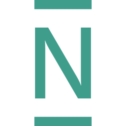

# YAXI for MoneyMoney

[MoneyMoney](https://moneymoney-app.com) is a popular multi-banking app for macOS.
Unfortunately, it does not [natively support every bank](https://moneymoney.app/banken/).
This extension adds support for additional banks through the [YAXI Open Banking](https://yaxi.tech) API which fills that gap: it enables accounts, balances, transactions, and instant bank transfers.
The YAXI API includes a free monthly usage tier.

### Currently supported banks

In general, YAXI supports more than 1,000 banks throughout Europe.
The extension currently has built-in support for the following banks:

<table>
  <tr>
    <td align="center"><br><sub>C24</sub></td>
    <td align="center"><br><sub>comdirect</sub></td>
    <td align="center"><br><sub>Deutsche Bank</sub></td>
    <td align="center"><br><sub>DKB</sub></td>
    <td align="center"><br><sub>ING</sub></td>
    <td align="center"><br><sub>N26</sub></td>
    <td align="center"><br><sub>Postbank</sub></td>
  </tr>
</table>

Contributions adding support for more banks [are welcome](CONTRIBUTING.md).

## Setup

https://github.com/user-attachments/assets/67ac5b81-8508-4bde-ad1b-7c11e4cfd116

### 1. Get an API key

Create a free API key by [signing up](https://yaxi.tech).

### 2. Download the extension

Download `yaxi.zip` from the [latest release](https://github.com/yaxitech/moneymoney/releases/latest).

### 3. Add your API key

Right-click `yaxi-config.json` and open it with a text editor (e.g., Text Edit) and enter your API key:

```json
{
  "apiKeyId": "your-key-id",
  "apiKeySecret": "your-key-secret"
}
```

Replace `your-key-id` and `your-key-secret` with the values from your API key. Save the file.

### 4. Install

In MoneyMoney navigate to the menu **Help → Show Database in Finder**, then drop `YAXI.lua` and `yaxi-config.json` into the **Extensions** folder.

### 5. Allow unsigned extensions

MoneyMoney only runs signed extensions by default. Since this is an actively developed community extension that is not signed by the MoneyMoney team, you need to allow unsigned extensions:

**MoneyMoney → Settings → Extensions → Allow unsigned extensions**

The extension runs inside MoneyMoney's sandbox with no direct filesystem or network access.

## Disclaimer & License

This extension is provided as-is and is not affiliated with or endorsed by MoneyMoney.
Use it at your own risk; see the [MIT License](LICENSE) for full terms.
